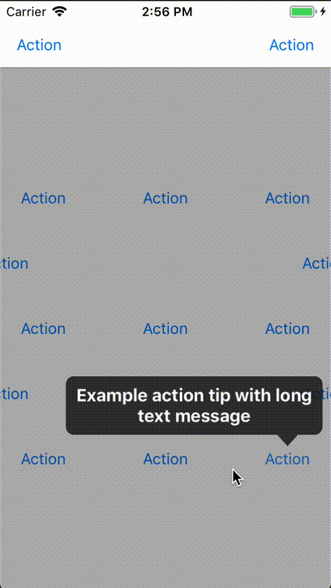

# APTips

[](https://github.com/Carthage/Carthage)
[](http://cocoapods.org/pods/APTips)
[](http://cocoapods.org/pods/APTips)
[](http://cocoapods.org/pods/APTips)
[](https://travis-ci.org/APUtils/APTips)

A simple tip that shows message to a user. It able to point to the element center and adjust its side depending on an available space but it uses only top and bottom sides. It able to handle complex UI with reusable cells and views in most cases. It also has an ability to show some tips only once so you won't need to write an additional logic for that.

## Example

Clone the repo and then open `Carthage Project/APTips.xcodeproj`

## GIF animation



## Installation

#### Carthage

Please check [official guide](https://github.com/Carthage/Carthage#if-youre-building-for-ios-tvos-or-watchos)

Cartfile:

```
github "APUtils/APTips" ~> 1.0
```

#### CocoaPods

APTips is available through [CocoaPods](http://cocoapods.org). To install
it, simply add the following line to your Podfile:

```ruby
pod 'APTips', '~> 1.0'
```

## Usage

Always show at the view's center:
```swift
let tip = Tip(message: "Example tip", pointingMode: .center, showMode: .always)
TipsManager.shared.show(tip: tip, for: view)
```

Show once at the sender's side:
```swift
let tip = Tip(message: "Example once tip", pointingMode: .center, showMode: .once)
TipsManager.shared.show(tip: tip, for: sender)
```

See example and test projects for more details.

## Contributions

Any contribution is more than welcome! You can contribute through pull requests and issues on GitHub.

## Author

Anton Plebanovich, anton.plebanovich@gmail.com

## License

APTips is available under the MIT license. See the LICENSE file for more info.
